# qbit-manager

A comprehensive Docker container combining qBittorrent with intelligent SSD management for high-performance torrenting with automatic space optimization.

## Overview

qbit-manager is an enhanced container that integrates:
- **qBittorrent v4.6.x** - Modern, feature-rich BitTorrent client with excellent WebUI
- **Intelligent SSD Cache Management** - Automatic migration from fast SSD to slower HDD storage
- **Background Processing** - Non-blocking execution with queuing and process management
- **Arr Integration** - Direct Sonarr/Radarr notifications via API
- **Smart Monitoring** - Health checks, logging, and performance optimization

## Key Features

### 🚀 **Performance Optimized**
- SSD caching for active downloads with automatic migration
- Intelligent space management with configurable thresholds
- Background processing prevents WebUI freezing
- Comprehensive retry logic and error handling

### 🔄 **Seamless Integration**
- Uses qBittorrent's "Run external program on torrent completed" feature
- Direct Sonarr/Radarr notifications via API
- Health monitoring with startup grace periods

### 🛡️ **Production Ready**
- Based on reliable linuxserver/qbittorrent container
- Structured logging with configurable levels
- Graceful error handling and recovery
- Docker health checks and monitoring

### 📁 **Smart File Management**
- Automatic verification of copy operations
- Safe relocation with path validation
- Configurable retry attempts for reliability
- Support for both single files and multi-file torrents

## Quick Start

### 1. Configure Environment
```bash
# Copy and edit environment file
cp env.example .env
# Set your paths, API keys, and qBittorrent credentials in .env
```

### 2. Build the Container
```bash
cd qbit-manager
docker build -t qbit-manager:latest .
```

### 3. Deploy with Docker Compose
```bash
docker-compose up -d
```

### 4. Configure qBittorrent
In qBittorrent WebUI, go to **Settings > Downloads** and set:
- **Run external program on torrent completed**: 
  ```
  python3 /app/qbit-manager/main.py "%I"
  ```

## Configuration

All configuration is handled via environment variables:

### Core Settings
```bash
# qBittorrent WebUI credentials
QBIT_HOST=localhost
QBIT_PORT=8080
QBIT_USERNAME=admin
QBIT_PASSWORD=adminadmin

# Storage paths (CRITICAL - must match your volume mounts)
DOWNLOAD_PATH_SSD="/downloads/ssd"          # Fast SSD cache
FINAL_DEST_BASE_HDD="/downloads/hdd"        # Permanent HDD storage

# Space management
DISK_SPACE_THRESHOLD_GB=100                 # Free space threshold for cleanup
COPY_RETRY_ATTEMPTS=3                       # Retry attempts for failed copies
MAX_CONCURRENT_PROCESSES=3                  # Max simultaneous torrent processes
```

### Arr Integration
```bash
# Notification settings
NOTIFY_ARR_ENABLED=true
SONARR_URL="http://sonarr:8989"
SONARR_API_KEY="your-sonarr-api-key"
RADARR_URL="http://radarr:7878"
RADARR_API_KEY="your-radarr-api-key"
SONARR_TAG="sonarr"                        # Category for TV shows
RADARR_TAG="radarr"                        # Category for movies
```

## How It Works

### Processing Flow

1. **Torrent Completes** → qBittorrent triggers external program
2. **Background Process** → Script spawns child process (non-blocking)
3. **Copy to HDD** → Files copied from SSD to HDD with verification
4. **Notify Arr** → Sonarr/Radarr notified via API
5. **Space Management** → Automatic SSD cleanup when threshold reached

```mermaid
graph TD
    A["🎯 qBittorrent Torrent Finished"] --> B["📋 qbittorrent-notification.sh<br/>(Collects all %I, %N, %L, %F, etc. params)"]
    B --> C["🌐 HTTP POST /notify/torrent-finished<br/>(JSON with hash + all params)"]
    C --> D["🎬 notify_torrent_finished() endpoint"]
    D --> E["📦 TorrentInfo.from_qbittorrent_params()<br/>(Complete data from notification)"]
    E --> F["📋 QueueItem(torrent=TorrentInfo)"]
    F --> G["⚡ orchestrator._process_queue()"]
    G --> H["🚀 _start_torrent_processing()"]
    H --> I["🔧 ThreadPoolExecutor.submit()"]
    I --> J["⚙️ _process_torrent_worker()"]
    
    J --> K["🎯 process_torrent_unified()"]
    K --> L{"🔍 Complete data?<br/>(name, path, size)"}
    L -->|✅ Yes| M["🚀 core.process_single_torrent_optimized()<br/>(No API calls - direct processing)"]
    L -->|❌ No| N["📡 get_torrent_info() - Fill missing data"]
    N --> O["🚀 core.process_single_torrent_optimized()<br/>(With complete data)"]
    
    M --> P["📂 Copy/Verify/Notify Logic<br/>(SSD → HDD + Arr notification)"]
    O --> P
    P --> Q["✅ Result Success/Failure"]
    Q --> R["📊 _on_process_complete()<br/>(Statistics & cleanup)"]
    
    style A fill:#e1f5fe
    style C fill:#f3e5f5
    style K fill:#e8f5e8
    style M fill:#e8f5e8
    style O fill:#e8f5e8
    style P fill:#fff3e0
    style Q fill:#f1f8e9
```



### Directory Structure

```
/downloads/ssd/                    # SSD cache (fast, temporary)
├── sonarr/                        # TV shows category
│   └── Show.S01E01.mkv           # Active downloads
└── radarr/                        # Movies category
    └── Movie.2023.mkv

/downloads/hdd/                    # HDD storage (permanent)
├── sonarr/                        # TV shows moved here
│   └── Show.S01E01.mkv           
└── radarr/                        # Movies moved here
    └── Movie.2023.mkv
```

## Migration from rTorrent/rflood

This project was migrated from an rTorrent-based system. Key differences:

### API Integration
- **Before**: Used pyrosimple library with SCGI socket connection
- **After**: Uses qbittorrent-api with REST API over HTTP

### Event Handling
- **Before**: rTorrent's `event.download.finished` hook
- **After**: qBittorrent's "Run external program on torrent completed"

### Container Base
- **Before**: Custom rflood container
- **After**: Standard linuxserver/qbittorrent with added Python layer

### Benefits of qBittorrent
- More active development and modern codebase
- Better WebUI with more features
- Cleaner API with better documentation
- Native support for categories (vs rTorrent labels)
- Better handling of magnet links

## Troubleshooting

### Script Not Triggering
1. Check qBittorrent settings for external program path
2. Verify script has execute permissions
3. Check qBittorrent logs for execution errors

### Connection Issues
1. Verify `QBIT_USERNAME` and `QBIT_PASSWORD` are correct
2. Check if WebUI is enabled in qBittorrent
3. Ensure container can reach qBittorrent on specified host/port

### Space Management Not Working
1. Check `DISK_SPACE_THRESHOLD_GB` is set appropriately
2. Verify paths match actual mount points
3. Check logs in `/config/log/qbit-manager.log`

## Development

### Running Tests
```bash
cd qbit-manager/pyrosimple-manager
pip install -r requirements.txt
pytest tests/
```

### Manual Testing
```bash
# Process specific torrent
docker exec qbit-manager python /app/qbit-manager/main.py TORRENT_HASH

# Trigger space management
docker exec qbit-manager python /app/qbit-manager/main.py

# Check status
docker exec qbit-manager python /app/qbit-manager/main.py --status
```

## License

This project maintains the same license as the original rflood-next implementation. 